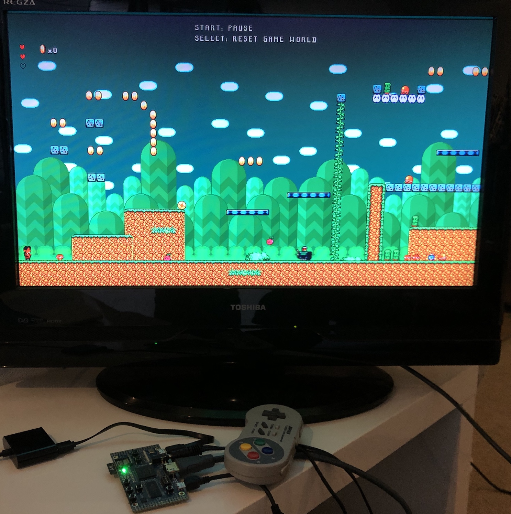

# Super Miyamoto Sprint (WIP)

This is a simple retro-inspired platformer game (implemented in C11) targetting a [retro-inspired FPGA game](https://github.com/dan-rodrigues/icestation-32) console by the same author (implemented in Verilog). It uses sprites and tilemaps to displays graphics similar to other games of the period and works with modest CPU speed and RAM.

One complete level is playable.



## Binaries

TODO

## Prerequisites

* GNU RISC-V toolchain for cross compilation
* GNU Make (any version >= 3.81 should work)

If running in the simulator using the `make sim` target for example, the [prerequisites here](https://github.com/dan-rodrigues/icestation-32/tree/master/simulator) are also needed.

If running on an iCEBreaker, ULX3S or other supported board, the [prerequsites here](https://github.com/dan-rodrigues/icestation-32#prerequisites) are also needed.

## Audio

Sound effects are included by default but music is not. Running any of the Makefile targets with `MUSIC=1` will:

1. Download and extract audio from a preconfigured Youtube video using youtube-dl with (default is included but can be changed in Makefile)
2. Convert it using ffmpeg to the required system format (IMA-ADPCM)
3. Include it in the output binary

### Extra prerequisities

Including music adds two prerequisities:

* [youtube-dl](https://github.com/ytdl-org/youtube-dl)
* [ffmpeg](https://ffmpeg.org/)

## Usage

The `CROSS` variable in the Makefile should match the prefix of the RISC-V toolchain. By default it is set to `riscv-none-embed-` which may not match the one installed on the machine.

This project depends on the system repo which is included as a submodule:

```
git submodule update --init --recursive
```
### Simulator (SDL2)

To build and run in the simulator:

```
make sim
```

### Usage on FPGA boards

The bitstream for the system itself must be flashed first using [these instructions](https://github.com/dan-rodrigues/icestation-32#build-and-program-bitstream).

To build and run on a given FPGA board:

#### ULX3S

```
make ulx3s_prog
```

```
make MUSIC=1 ulx3s_prog
```

The default ULX3S programmer used is fujprog which can be a bit slow for large files. If the built with `MUSIC=1` then it might take a minute or two.
#### iCEBreaker

```
make icebreaker_prog
```
```
make MUSIC=1 icebreaker_prog
```

## Controls

The game can be controlled with (limited) buttons on the FPGA board or with certain USB gamepads. Top level verilog modules for each board show which options are available if any. The simulator uses SDL keyboard input for control.

* Left/Right: Move
* Up: Climb
* Down: Duck
* B: Jump
* Y: Run
* L: Exit vehicle*
* R: Perform vehicele action (like firing a projectile)*
* Select: Reset game state (debug)*
* Start: Pause*

*: USB gamepad is needed for these.

## Acknowledgements

Open game art was used for the graphics and audio with some minor alterations. A full list of attributions to the artists is in the [ATTRIBUTIONS.md](assets/ATTRIBUTIONS.md) file.
